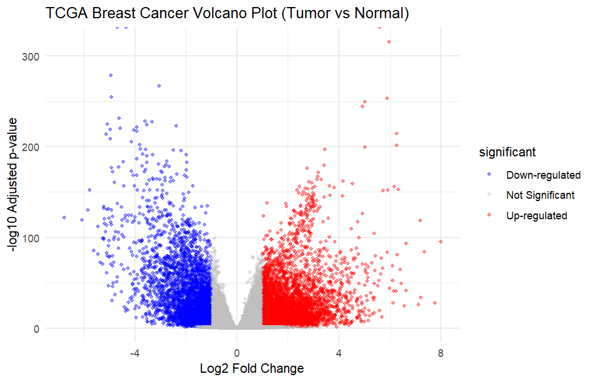
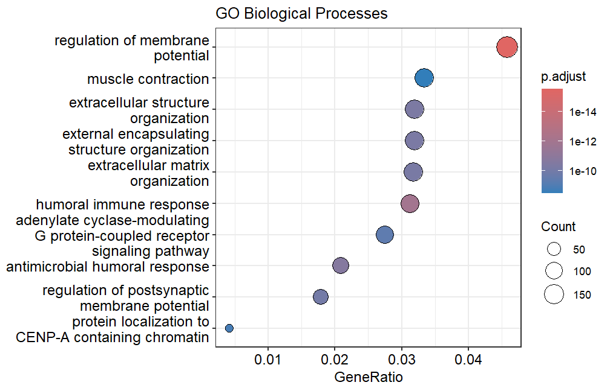
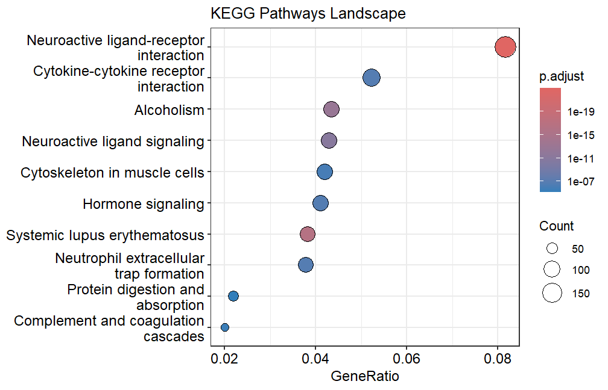
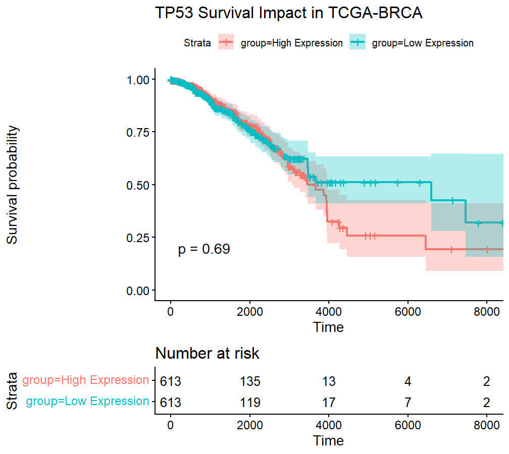

# TCGA Breast Cancer (BRCA) Multi-Omics Expression & Clinical Survival Pipeline

## 🧬 Project Overview
This project implements an end-to-end transcriptomic and clinical biomarker discovery pipeline in R using Bioconductor ecosystems. The workflow ingests RNA-Seq expression counts from the GDC portal, isolates differentially expressed genes (DEGs) between primary mammary tumors and solid normal tissues, maps their mechanistic functional roles, and evaluates their statistical impact on longitudinal patient survival outcomes.

## 🚀 Key Engineering & Biological Highlights
* **Robust Data Caching:** Implements an automated local caching check (`file.exists`) for the raw `TCGA-BRCA` dataset to eliminate redundant internet downloads and optimize runtime performance.
* **Low-Count Filtering:** Removes low-count transcript variants (genes with < 10 total reads across samples) to reduce statistical noise and accelerate the `DESeq2` estimation steps.
* **Censored Survival Re-engineering:** Fixed standard data-loss traps by dynamically merging `days_to_death` (uncensored) and `days_to_last_follow_up` (right-censored) clinical columns, preserving vital data from living cohorts.

## 🛠️ Tech Stack & Dependencies
* **Bioconductor Engines:** `TCGAbiolinks` (Data Mining), `DESeq2` (Differential Expression Matrix), `clusterProfiler` / `org.Hs.eg.db` (Annotation & ORA Mappings)
* **Statistical / Clinical Analysis:** `survival` (Kaplan-Meier Fitting), `survminer` (Risk Tables & Curve Plotting)
* **Visualization Layer:** `ggplot2`, `enrichplot`

## 📂 Project Architecture
```text
├── r_scripts/
│   └── brca_pipeline.R         # Main data-processing and analytics script
├── images/
│   ├── volcano_plot.png        # Transcripts distribution profile
│   ├── go_enrichment.png       # Gene Ontology Dotplot (Biological Process)
│   ├── kegg_enrichment.png     # KEGG Molecular Pathways Distribution
│   └── tp53_survival_curve.png # Kaplan-Meier survival curves with Risk Grid
└── README.md                   # Project documentation and deployment guide
```

## 📊 Pipeline Results & Visualizations

### 1. Differential Expression Profile
The expression matrix was normalized using empirical Bayes shrinkage methods. Transcripts were stratified into Up-regulated, Down-regulated, and Non-significant states based on strict biological criteria ($|Log2FC| > 1$ and $p_{adj} < 0.05$).



### 2. Functional Enrichment Over-Representation Analysis (ORA)
To decode downstream cellular mechanics, significantly altered Ensembl IDs were translated to Entrez IDs. Functional annotations map heavily to key metabolic shifts and cell-cycle regulatory breakdown.

| Gene Ontology (GO - Biological Process) | KEGG Pathways Mapping |
|---|---|
|  |  |

### 3. Clinical Biomarker Association (TP53 Case Study)
Patient records were stratified into "High" vs. "Low" expression cohorts based on the median expression profile of the target marker (`TP53`). The survival modeling captures a complete log-rank p-value computation alongside a clinical "patients at risk" tracker.



## 🏁 How to Execute This Pipeline
1. Clone this repository locally:
   ```bash
   git clone https://github.com
   cd YOUR_REPOSITORY_NAME
   ```
2. Ensure you have the mandatory system and bioc-packages loaded in your R session.
3. Source the primary analytics pipeline:
   ```r
   source("r_scripts/brca_pipeline.R")
   ```
